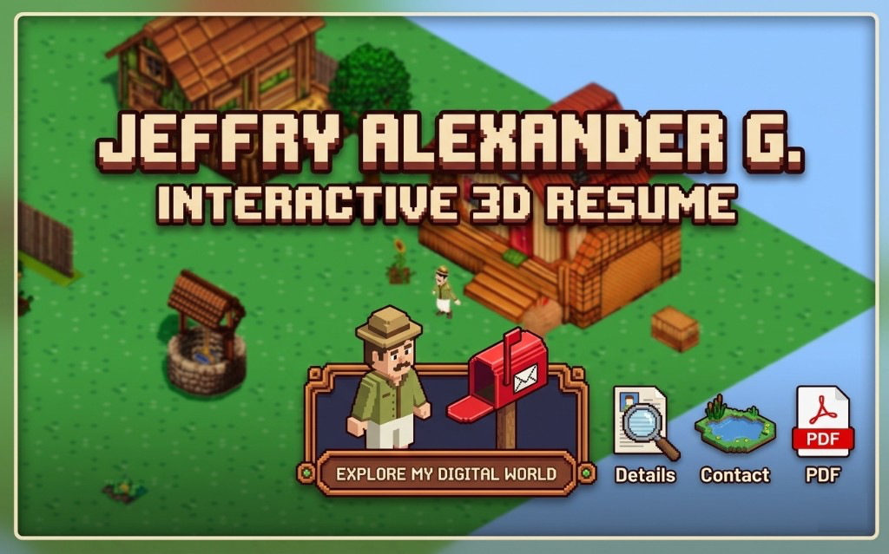

  

# Jeff — Interactive 3D Resume

A small isometric farm scene built with **Three.js** and **Vite**. Move with **WASD** or arrow keys and click buildings to open resume sections.

## Scripts

- `npm run dev` — local dev server
- `npm run build` — production bundle
- `npm run preview` — serve the production build
- `npm run lint` — ESLint on `src/`
- `npm run check:assets` — inspect GLB asset sizes
- `npm run prepare:decoders` — copy Draco/Basis/Meshopt decoders to `public/decoders`
- `npm run optimize:textures` — generate texture-optimized models in `public/models-texture-optimized`
- `npm run compress:models` — generate mesh+texture optimized models in `public/models-optimized`
- `npm run perf:budget` — enforce chunk/model performance budgets
- `npm run test` — run smoke/unit checks
- `npm run release:check` — run pre-release production gate (lint + test + build + perf budget)

## Keyboard shortcuts

| Key | Action |
|-----|--------|
| WASD / arrows | Move |
| Click building | Open CV panel |
| Esc | Close panel |
| F | Photo mode (hide chrome) |
| Shift+D | Toggle collider debug helpers |

## Layout data

Default positions live in `src/default-farm-layout.json` as `{ "version": 3, "items": [...] }`. Older flat arrays in `localStorage` under `farmLayout` / `farmLayout_v2` are migrated automatically to `farmLayout_v3`.

## Target devices

Tested for desktop browsers with WebGL. Mobile: view-only interactions (click/tap) work; walking is keyboard-focused.

## Performance workflow

1. Run `npm run prepare:decoders`.
2. Run `npm run optimize:textures` (fallbacks to WebP if KTX tool is unavailable).
3. Run `npm run compress:models`.
4. Build and validate budget: `npm run build && npm run perf:budget`.
5. Review baseline report at `docs/performance-baseline.md`.

## Vercel deployment

### Project settings
- Framework preset: `Vite`
- Build command: `npm run build`
- Output directory: `dist`
- Install command: `npm install`

### Model source policy
- Default runtime policy uses `public/models-optimized` for non-critical models.
- Critical paths (such as player) keep original source for visual stability.
- If needed, set `VITE_MODEL_SOURCE_POLICY=original` to force original models in production.

### Pre-release checklist
1. `npm run prepare:decoders`
2. `npm run release:check`
3. Validate local preview: `npm run preview`
4. Validate runtime:
   - movement works
   - double-tap run works
   - opening CV panel works
5. Deploy preview branch in Vercel, then promote to production.
